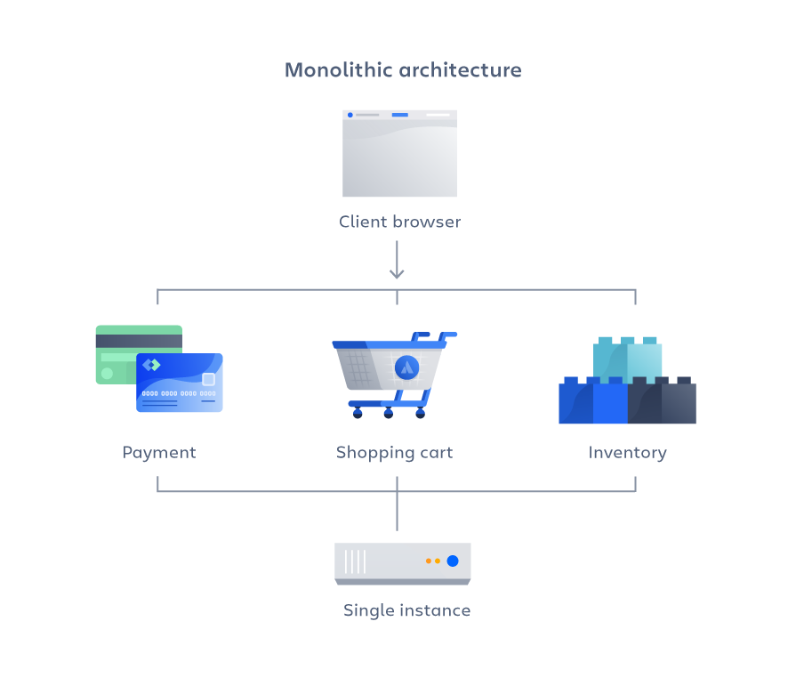

# Architecture 
Internal design details for building the applications.

## Monolithic Architecture
- Monolithic architecture is a traditional software design approach where an entire application is built and deployed as a single, unified unit. All components—including user interface, business logic, and data access—are developed together, maintained within the same codebase, and share the same resources and database. This model is straightforward for development and deployment but can present challenges when scaling and maintaining large or complex applications due to tightly coupled components and dependencies.

- If all the components and functionalities of a project are entangled and combined in a single codebase, then that is a monolithic application.

- Monolithic system is also known as centralised system.

## Advantages:

- Simple to develop for small apps.
- Easier to test & deploy as one package.
- Less complex initially.

## Disadvantages:

- Every module is combined in a single system, so if there is an error or bug in a single module, it can destroy the complete system.

- Whenever a single module is updated, the whole system needs to be updated to reflect the changes to the user. All modules are present in a single system and are connected to one another, so the whole system needs to be updated.

- Not flexible for modern cloud/distributed systems.