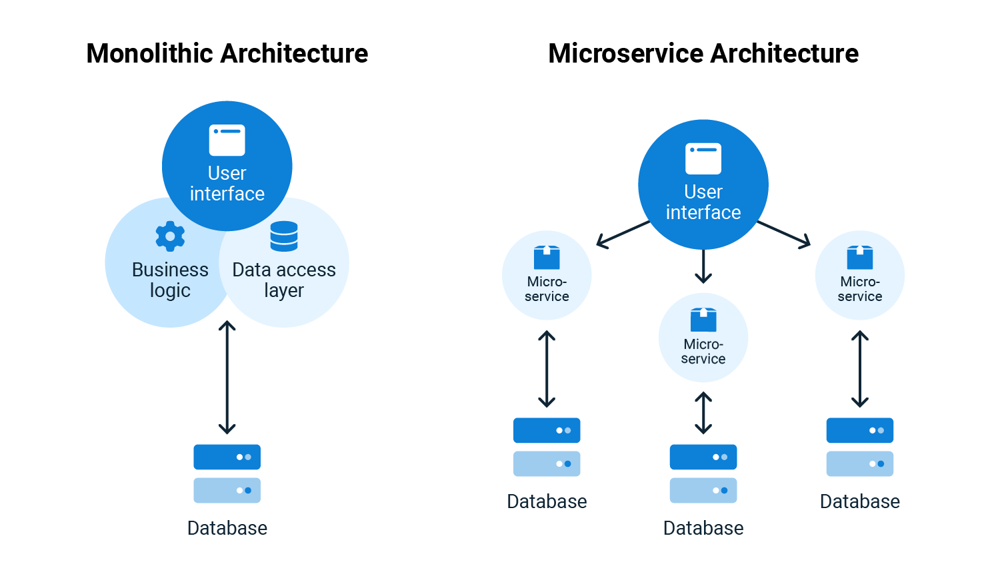

# What is a Distributed system?

A Distributed System is a collection of independent computers (nodes/servers) that work together as a single system for the user.

In other words, A Distributed System is a collection of multiple individual systems connected through a network that share resources, communicate and coordinate to achieve common goals.

- Each machine has its own memory and CPU.
- They communicate with each other over a network.
- To the end user → it looks like one unified system.

👉 In short: “Many computers working together to appear as one.”

## Key Characteristics

- `Transparency` – Users don’t see multiple machines; they see one system.
- `Scalability` – Easy to add more machines.
- `Fault Tolerance` – If one machine fails, others can continue.
- `Concurrency` – Many processes run at the same time.
- `Resource Sharing` – Nodes share files, databases, services.

## Advantages

- `High availability` → no single point of failure.
- `Scalability (Horizontal scaling)` → add more nodes easily.
- Faster performance (parallelism).
- Resource sharing.

## Disadvantages

- Complex to design.
- Harder debugging & monitoring.
- Network dependency (latency, failure).

## What is Replication in Distributed Systems?

Replication means storing copies of the same data on multiple nodes (servers) in a distributed system.

- Each copy is called a replica.
- If one node fails, other replicas still serve the data.
- Improves availability, reliability, and fault tolerance.

## Why Replication is Needed?
- `Fault Tolerance` – If one replica is down, another can serve requests.
- `High Availability` – Users can still access data even during failures.
- `Load Balancing` – Reads can be spread across replicas.
- `Performance` – Data can be placed closer to users (geo-replication).