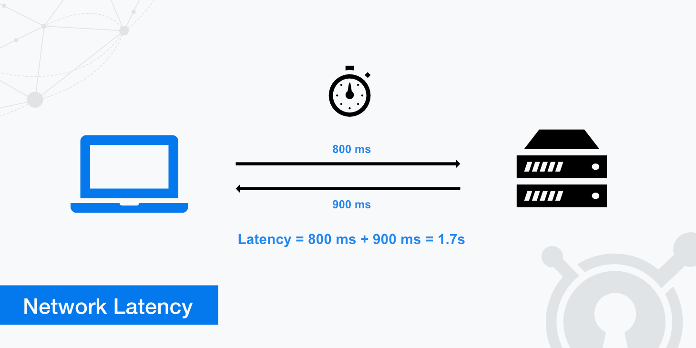

# What is latency?

- Latency = the time delay between a user’s action and the system’s response.
- Latency = how long it takes for data to travel from source to destination.
- It’s measured in milliseconds (ms).

👉 Example:
- You click “Play” on Netflix → the time before the video actually starts streaming = latency.

## Causes of Latency

- `Network latency` – Delay in data transmission across the internet.
- `Database latency` – Slow queries, unoptimized indexes.
- `Application latency` – Heavy code execution, blocking tasks.
- `Disk latency` – Slow read/write from storage.
- `Geographical distance` – User far away from server.

## How to reduce latency?

1. Networking Improvements

    - Use a CDN (Content Delivery Network) → bring data closer to users.
    - Reduce network hops (fewer routers = faster).
    - Use faster protocols (HTTP/2, HTTP/3, gRPC, WebSockets).
    - Optimize DNS resolution (DNS caching).

2. Application Level

    - Cache frequently used data (Redis, Memcached).
    - Use asynchronous processing for long tasks.
    - Minimize payload size (compress JSON, gzip, Brotli).
    - Reduce API calls → batch requests.

3. Database Optimization

    - Add indexes for fast queries.
    - Use replicas to serve read-heavy traffic.
    - Optimize queries & schema design.
    - Use in-memory databases where needed.

4. Infrastructure Level

    - Deploy servers closer to users (geo-distributed).
    - Use load balancers to spread requests.
    - Scale horizontally (more servers instead of one big server).
    - Use faster storage (SSD over HDD).

5. Code Optimization

    - Avoid nested loops & blocking I/O.
    - Use profiling tools to detect bottlenecks.
    - Optimize algorithms (O(n) instead of O(n²)).

## Real Example

- `Without CDN` → User in India requests a file from a US server → 300 ms latency.
- `With CDN` → File is cached in India → 50 ms latency.

## In short:
- Latency = delay in response.
- To reduce it → cache data, use CDNs, optimize databases & code, distribute servers geographically, and use async processing.