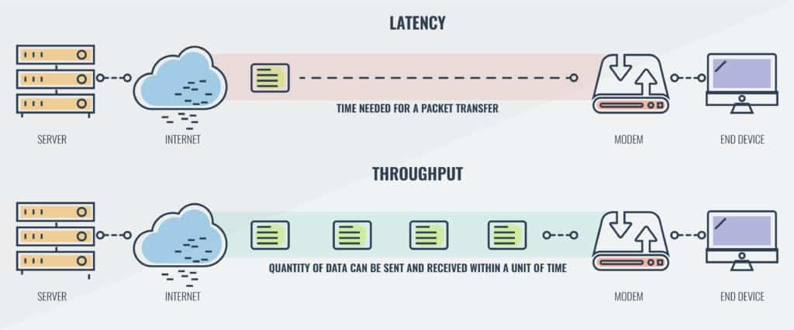

# What is throughput?

Throughput is the amount of work a system can handle in a given period of time — basically, how many requests, operations, or transactions are processed per second.

`Throughput` = How much work is done per unit time

`Latency` = How long it takes to do one piece of work

## Example

Let’s say you have a web server:

- It takes `100 ms` to respond to one request → `Latency = 100 ms`.

- It can handle `1000 requests per second` → `Throughput = 1000 req/sec`.

So even if latency per request is small, if your system can process many requests in parallel, the throughput will be high.

## Factors Affecting Throughput
- Hardware resources (CPU, RAM, I/O speed)
- Concurrency (number of parallel workers or threads)
- Network bandwidth
- Database performance
- Load balancing and caching

## How to Increase Throughput

- Use load balancers to distribute requests.
- Enable horizontal scaling (more servers).
- Use caching layers (Redis, CDN).
- Optimize database queries and indexing.
- Use asynchronous or non-blocking I/O (Node.js, Kafka, etc.).
- Batch small tasks into bulk operations.

## In terms of Monolithic and Distributed

- `Monolithic` → Fast per request (low latency), but can’t handle too many users (limited throughput).
- `Distributed` → Slightly slower per request (higher latency), but can handle many users at once (high throughput).

