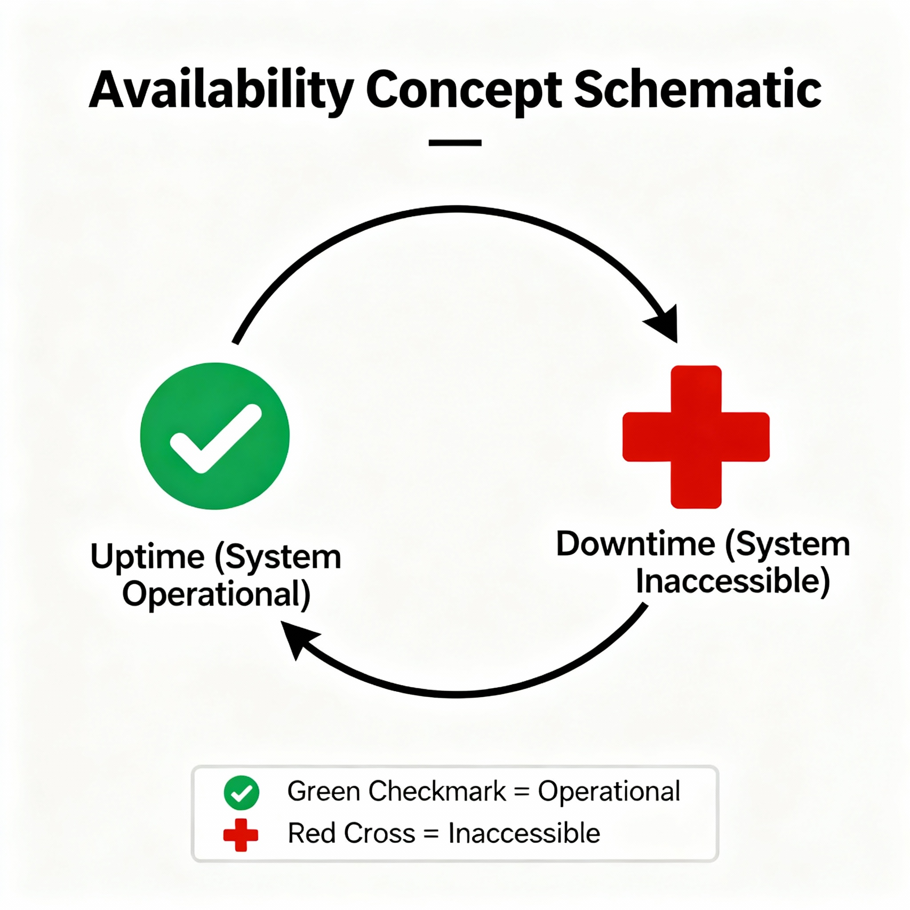

# What is availability? (replication vs redundancy)

Availability means how reliably your system stays up and accessible to users — i.e., the percentage of time your system is operational.

Formally:
```
Availability = (Uptime / (Uptime + Downtime)) × 100%
```

So, if your server is up 99.99% of the time, that’s called “four nines” (99.99%) availability.

## Availability in Monolithic Systems

✅ Characteristics

- All components are tightly coupled and run as one unit.
- If one part (like the database or backend) fails → the whole application goes down.
- There’s typically a single point of failure.

⚠️ Result:

- Lower availability, unless you have redundant backup servers.
- Maintenance or deployment requires downtime.

Example:

If your monolithic app server crashes, users cannot access any part of the app until it restarts.

## Availability in Distributed Systems
✅ Characteristics

- Components are distributed across multiple machines or regions.
- Even if one node or service fails, others can still serve users.
- Systems are designed with replication, load balancing, and failover mechanisms.

## Techniques to Increase Availability:

- `Replication` – multiple copies of data (so one node failure doesn’t stop service).
- `Load Balancing` – traffic automatically routed to healthy nodes.
- `Auto-Scaling` – new servers spin up automatically when others fail.
- `Health Checks & Monitoring` – detect failures early.
- `Failover Mechanisms` – standby servers take over automatically.

## Result:
- High availability (99.99%+) possible.
- Users experience minimal downtime even during failures.

## In Simple Terms
- `Monolithic`: Like one big machine — if one part breaks, the whole machine stops.
- `Distributed`: Like a network of machines — if one fails, others keep working.



## Replication vs Redundancy

`Replication`: Replication means making and maintaining multiple copies of data or services across different servers (nodes).

`Redundancy`: Redundancy means having extra components, systems, or resources that can take over when something fails — not necessarily copies of data, but backup systems in general.

| Feature              | **Replication**                          | **Redundancy**                                |
| -------------------- | ---------------------------------------- | --------------------------------------------- |
| **Definition**       | Duplicating *data* across multiple nodes | Having *backup systems or components*         |
| **Focus**            | Data availability and consistency        | System reliability and fault tolerance        |
| **Example**          | Database replicas (Primary & Secondary)  | Multiple servers, disks, or network links     |
| **Level**            | Usually data layer                       | Infrastructure / hardware / network layer     |
| **When Used**        | For database or stateful services        | For hardware, servers, or critical components |
| **Failure Handling** | Reads/writes redirected to replicas      | Backup system replaces failed one             |
