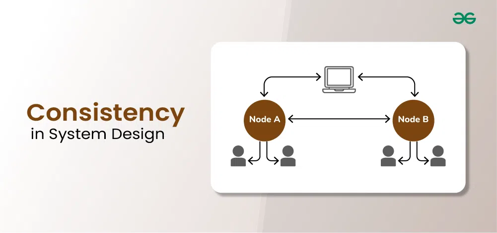

# What is Consistency in System Design?

When more than one client requests the system, for all such requests, it will be called consistent when each client gets the same data. The data should always be consistent, regardless of who is accessing it.

Every read operation should return the most recent (up-to-date) data after a successful write.

So, once you write (or update) some data, all users or services reading that data should get the same and latest value — no stale or old data anywhere.

## Think of it like this:

If you deposit ₹1000 into your account using one banking server,
- and immediately check your balance from another server,
- you should see ₹1000 reflected right away.

If one server shows ₹1000 and another still shows ₹0 — that’s inconsistency.

## Factors Improving Consistency
- Improving Network Bandwidth.
- Stop the read operations until all the servers up.
- Replication based on Distance aware strategies.

## Types of Consistency

1. `Strong Consistency`: When the system doesn't allow read operations until all the nodes with replicated data are updated.

2. `Eventual Consistency`: User Read requests are not halted till all the replicas are updated rather the update process is eventual. Some users might receive old data but eventually all the data is updated to the latest data.

3. `Causal (Weak) Consistency`: No need to update all the nodes.

## Example in Distributed Systems

Let’s say your system has 3 servers (replicas):

| Server | Data (user_balance) |
| ------ | ------------------- |
| A      | ₹1000               |
| B      | ₹1000               |
| C      | ₹1000               |

✅ Consistent State — all replicas agree on the same data.

❌ Inconsistent State — if one of them still has old data after a write.

## Consistency in term of Monolithic and Distributed System

### In a Monolithic System

- here is a single database and application.
- So all reads and writes happen in one place — making consistency easy to maintain.
- Once data is written, everyone sees the same updated value immediately.

✅ Strong consistency by default.

### In a Distributed System

- Data is spread across multiple servers or replicas.
- When one server updates data, it takes time to sync with others.
- During that delay, some nodes may have old (stale) data.

⚠️ Consistency becomes harder — systems often use eventual consistency.