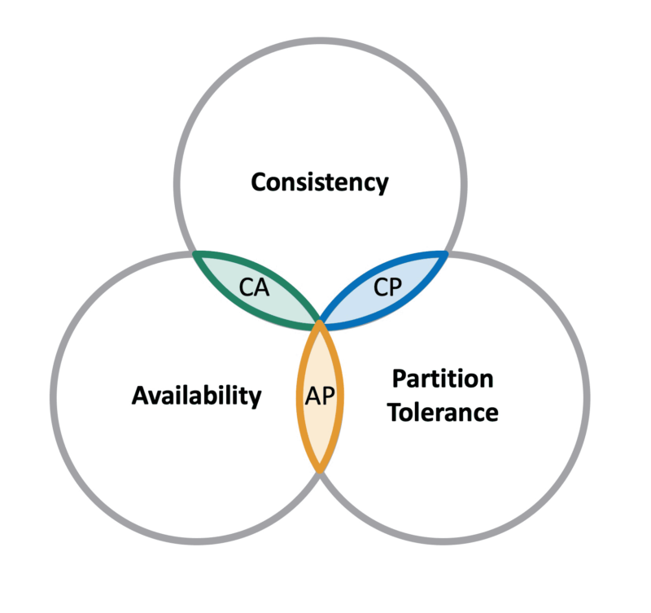

# What is CAP theorem?

In a distributed system, you can’t have all 3 perfectly at the same time:

For a distributed system, the CAP Theorem states that it is possible to attain only two properties and the third would be always compromised.

The system requirements should define which two properties should be chosen over the rest.

| Term                        | Meaning                                                |
| --------------------------- | ------------------------------------------------------ |
| **C – Consistency**         | All nodes see the same data at the same time           |
| **A – Availability**        | Every request gets a response (even if not the latest) |
| **P – Partition Tolerance** | System continues to work despite network failure       |

So, a system must choose between Consistency and Availability during network issues.

## Example Trade-offs

| System Type    | Example              | Preference                     |
| -------------- | -------------------- | ------------------------------ |
| Banking System | Account balance      | **Consistency > Availability** |
| Social Media   | Likes/comments count | **Availability > Consistency** |

## Important Poins
- The system designer can select Consistency and Partition Tolerance but the availability would be compromised then.

- The system designer can select Partition Tolerance and Availability but the Consistency would be compromised then.

- The system designer can select Availability and Consistency but the Partition Tolerance would be compromised then.

## Simple Summary

✅ Partition Tolerance (P) is always required.

Then you choose between:

- Consistency (C) if accuracy is critical (e.g., banking).
- Availability (A) if uptime is critical (e.g., social media).