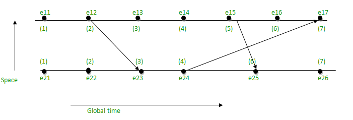
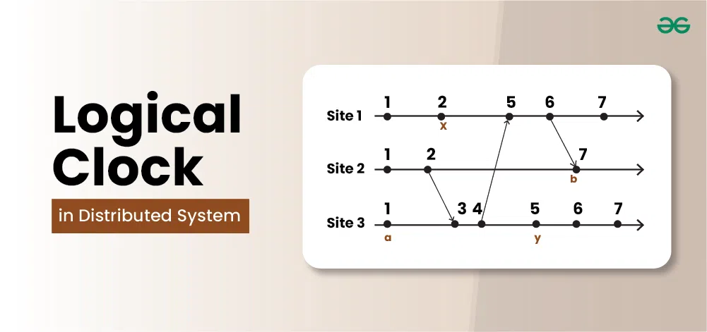

# What is Lamport Clock?

A Lamport Clock is a `logical clock` — used in distributed systems to `order events` and determine `which event happened before another, without relying on real-time clocks`.

It helps maintain “happened-before” relationships between events in different nodes of a distributed system.

## Why We Need It?

In a distributed system:

- Each server (node) has its own local clock.
- These clocks are not perfectly synchronized.
- So, we can’t depend on timestamps to know the true order of events.

👉 Example:
Server A thinks it’s 10:01:03

Server B thinks it’s 10:01:01

- but which event really happened first? We can’t be sure based on real time.

That’s where `Lamport timestamps` come in.

## How Lamport Clock Works

Each process maintains a `logical counter (integer)` instead of a real timestamp.

1. Each event in a process increments its own counter by 1.
2. When a message is sent, it includes the sender’s counter.
3. When a message is received, 

the receiver sets its counter to:
```
max(its_own_counter, sender_counter) + 1
```

## Real-World Usage

- Distributed databases (e.g., Cassandra, DynamoDB, CockroachDB).
- Event ordering in message queues or logs.
- Version control systems for conflict resolution.


A `Lamport Clock` assigns a logical timestamp to each event in a distributed system to maintain `causal ordering`, ensuring that if one event affects another, their order is preserved — even without synchronized clocks.



