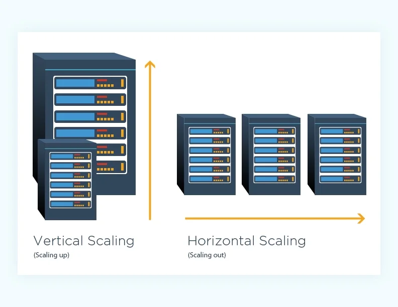

# Difference between horizontal and vertical scaling

## Scaling Overview
When your app grows (more users, data, or traffic), you need to increase system capacity — that’s called scaling.

There are two main types:

## 1. Vertical Scaling (Scaling Up)
Adding more power (CPU, RAM, SSD, etc.) to your existing server.

### Example:
- Upgrading from a 4-core CPU with 16 GB RAM → to an 8-core CPU with 64 GB RAM.
- Same server, just stronger.

### Advantages:
- Simple to implement
- No change in application logic
- Works well for smaller systems

### Disadvantages:
- Expensive hardware upgrades
- Physical limits (can’t scale infinitely)
- Downtime during upgrades
- Single point of failure (if one server crashes, system goes down)

## 2. Horizontal Scaling (Scaling Out)
Adding more servers/nodes to distribute the load.

### Example:
- Instead of 1 powerful server, use 5 medium ones.
- Each server handles part of the data or traffic.

### Advantages:
- Supports large-scale growth (used by Google, Facebook, etc.)
- High availability — if one node fails, others continue
- Easier load balancing and redundancy

### Disadvantages:
- More complex setup and maintenance
- Requires distributed systems (e.g., MongoDB Sharding, Load Balancers)
- Data consistency challenges

## Comparison Table
| Feature             | Vertical Scaling                                  | Horizontal Scaling                  |
| ------------------- | ------------------------------------------------- | ----------------------------------- |
| **Definition**      | Add more resources (CPU, RAM) to existing machine | Add more machines to share the load |
| **Example**         | Upgrade from 8GB → 64GB RAM                       | Add 4 more servers                  |
| **Complexity**      | Simple                                            | Complex                             |
| **Cost**            | High (hardware upgrade)                           | Moderate (more commodity servers)   |
| **Limit**           | Limited (hardware limit)                          | Virtually unlimited                 |
| **Downtime**        | Often required                                    | Usually none                        |
| **Fault Tolerance** | Low (single point)                                | High (distributed)                  |
| **Used in MongoDB** | Replica set scaling                               | Sharding                            |

## Quick Analogy
- `Vertical Scaling` = Making one person stronger 💪
- `Horizontal Scaling` = Hiring more people 👥

