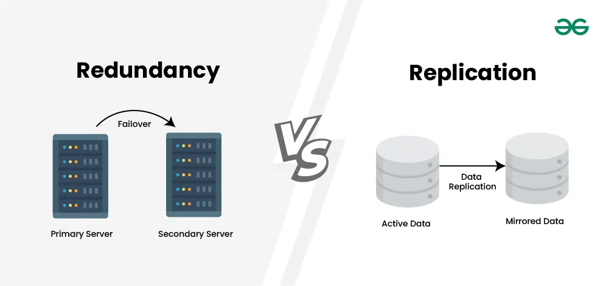
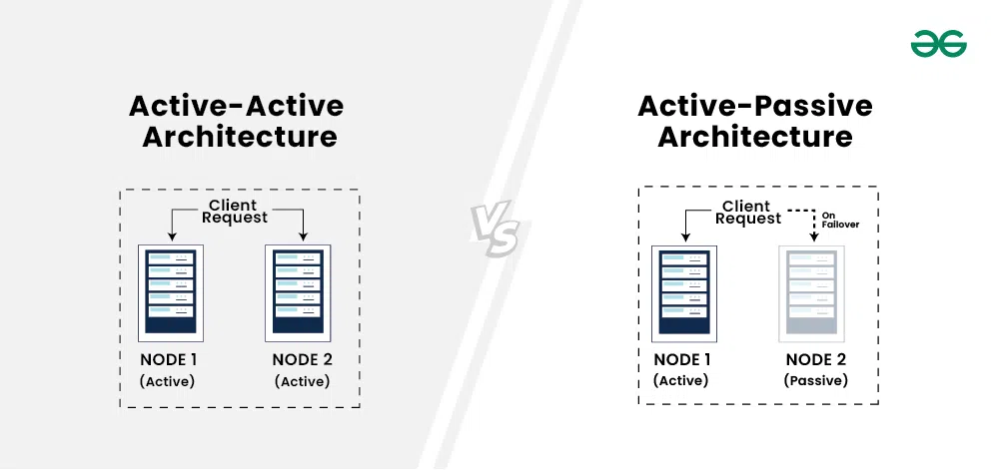
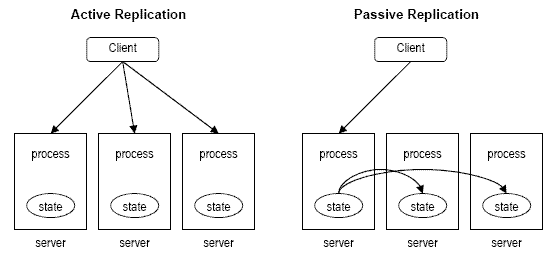

# Difference between Redundancy and Replication

## Key Differences

| Feature              | **Replication**                                     | **Redundancy**                                      |
| -------------------- | --------------------------------------------------- | --------------------------------------------------- |
| **Definition**       | Creating real-time or near real-time copies of data | Having backup or extra components/systems           |
| **Goal**             | High availability & fault tolerance                 | System reliability & disaster recovery              |
| **Synchronization**  | Data is continuously synchronized                   | Data/components may or may not be synchronized      |
| **Active Usage**     | Replicas can serve read/write operations            | Redundant systems are mostly idle (used on failure) |
| **Scope**            | Data-level                                          | System-level or hardware-level                      |
| **Example**          | MongoDB replica set, MySQL master-slave             | Backup server, RAID disk, power redundancy          |
| **Failure Handling** | Failover happens automatically (elect new primary)                                            |   Backup manually or automatically activated when needed                                                  |

## Redundancy
Redundancy is simply the duplication of nodes or components so that when a node or component fails, the duplicate node is available to service customers.

There are two types of Redundancy:

1. `Active Redundancy`: Active Redundancy is considered when each unit is operating/active and responding to the action. Multiple nodes are connected to a load balancer, and each unit receives an equal load.

2. `Passive Redundancy`: Passive Redundancy is considered when one node is active or operational and the other is not operating. During the breakdown of the active node, the passive node maintains availability by becoming the active node.

## Replication
Replication + Synchronization

It maintaining multiple copies of the same data across different servers to ensure high availability, fault tolerance, and data redundancy.

There are two types of Replication:

### 1. `Active Replication`: 
In Active Replication, all replicas handle client requests simultaneously. 
Each replica processes the same request in parallel and produces the same result — assuming they all start from the same state and the operations are deterministic.

#### Example
- Suppose there are 3 replica servers.
- When a client sends a write request, it goes to all 3 replicas at once.
- Each replica executes the operation independently.
- A consensus mechanism ensures all replicas stay consistent.

### 2. `Passive Replication`: 
In Passive Replication, only one replica (Primary) handles client requests. The other replicas (Backups) stay idle and replicate the primary’s state.

If master goes down one slave becomes master.

Master-slave replication can be either synchronous or asynchronous. The difference is simply the timing of propagation of changes. If the changes are made to the master and slave at the same time, it is synchronous. If the changes are queued up and written later, it is asynchronous.

#### Example (like MongoDB Replica Set)
- Client writes to the Primary.
- The Primary applies the update and then sends the operation log to Secondaries.
- Secondaries replay the operations to stay in sync.
- If Primary fails → a Secondary is elected as new Primary.

## In short:

- `Replication` = Real-time data copying for availability.

- `Redundancy` = Backup components for reliability and fault recovery.