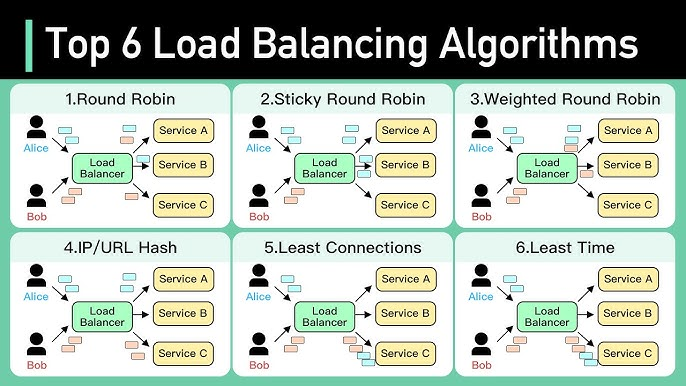

# What is load balancer and How it works?

Load Balancing is the process of efficient distribution of network traffic across all nodes in a distributed system.

## Roles of Load Balancer
1. The load distribution is equal over every node.
2. Health Check (if the node is not operational, the request is passed to another node that is up and running)
3. Load balancers ensures high scalability, high throughput and high availability.

## Why Do We Need a Load Balancer?

Without it:

- One server could become overloaded while others sit idle.
- If one server crashes, users face downtime.

With a Load Balancer:

- Workload is distributed evenly
- Requests are redirected automatically if a server fails
- Scalability and fault tolerance improve drastically

## How a Load Balancer Works (Step-by-Step)

1. `Client Request`: A client (browser or app) sends a request (e.g., to www.myapp.com).

2. `DNS or LB IP`: The domain name points to the Load Balancer’s IP address instead of a single server.

3. `Load Balancer Decision`: The LB receives the request and decides which backend server should handle it.

4. `Forwarding Request`: It forwards the request to that server and waits for a response.

5. `Response Sent Back`: The server sends the response to the LB, and the LB forwards it to the client.

✅ To the user, it looks like they’re communicating with one server, but internally it’s multiple servers working together.

## Common Load Balancing Algorithms

| Algorithm                | Description                                                         |
| ------------------------ | ------------------------------------------------------------------- |
| **Round Robin**          | Distributes requests one by one to each server sequentially         |
| **Least Connections**    | Sends new requests to the server with the fewest active connections |
| **IP Hash**              | Chooses a server based on the client’s IP address                   |
| **Weighted Round Robin** | Assigns higher weight (priority) to powerful servers                |
| **Random**               | Chooses a random backend server for each request                    |



## Types of Load Balancers

| Type            | Description                                | Example                               |
| --------------- | ------------------------------------------ | ------------------------------------- |
| **Hardware LB** | Physical device used in large data centers | F5, Citrix                            |
| **Software LB** | Runs as an application or service          | Nginx, HAProxy, Envoy                 |
| **Cloud LB**    | Managed by cloud providers                 | AWS ELB, GCP Load Balancing, Azure LB |


## Example Architecture

```
           ┌──────────────┐
           │    Clients   │
           └──────┬───────┘
                  │
          ┌───────▼────────┐
          │ Load Balancer  │
          └───────┬────────┘
          │       │        │
   ┌──────▼───┐ ┌──▼───-─┐ ┌──▼───--┐
   │ Server 1 │ │Server 2│ │Server 3│
   └──────────┘ └────────┘ └────────┘
```

Users’ requests are distributed among servers 1, 2, and 3 automatically.

## Benefits of Load Balancer

- High Availability — if one server fails, others serve traffic
- Better Scalability — easily add or remove servers
- Improved Performance — prevents overloads
- Enhanced Security — can hide backend servers from direct access

## Potential Drawbacks

- Single point of failure (if not configured with redundancy)
- Slight latency overhead (because of extra hop)
- Requires careful session handling (sticky sessions or centralized storage)