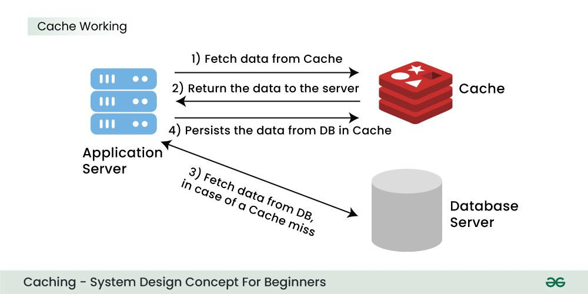

# What is Caching?

Caching is a technique used in computing to store copies of frequently accessed data in a temporary storage location (called a cache) so that future requests for that data can be served faster.

Caching is like keeping a shortcut — instead of fetching the same data repeatedly from a slow source (like a database or API), you save it somewhere faster (like memory) for quick access.

## How It Works

1. When a request for data comes in, the system first checks the cache.

- If the data is found (called a cache hit), it’s returned immediately.

- If it’s not found (called a cache miss), the system fetches it from the main source, stores it in the cache, and then returns it.

## Common Types of Caching

| Type                              | Description                                                      | Example                                             |
| --------------------------------- | ---------------------------------------------------------------- | --------------------------------------------------- |
| **Browser Cache**                 | Stores website files (HTML, CSS, JS, images) on your device.     | Visiting a site again loads faster.                 |
| **Server Cache**                  | Stores generated responses on the server to avoid recalculating. | API results caching.                                |
| **Database Cache**                | Stores frequent query results.                                   | Redis or Memcached used to cache SQL query results. |
| **Application Cache (In-memory)** | Keeps temporary data inside app memory.                          | Using `Node.js` memory or React Query cache.        |
| **CDN Cache**                     | Stores static files close to the user’s location.                | Cloudflare or Akamai caching static assets.         |

## Benefits

- Faster performance
- Reduced server load
- Better scalability
- Lower network latency

## Potential Drawbacks

- Stale data if the cache isn’t updated properly.
- Extra complexity in cache invalidation (deciding when to refresh or remove data).
- Memory usage overhead.

## Popular Caching Tools

- Redis
- Memcached
- Varnish
- Service Workers (for web apps)
- HTTP caching headers (Cache-Control, ETag, etc.)

