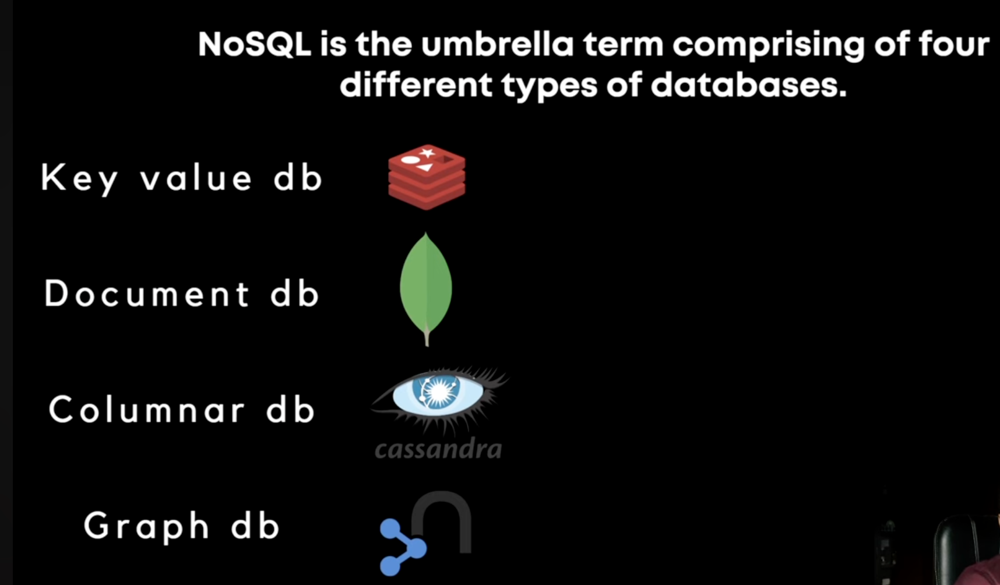
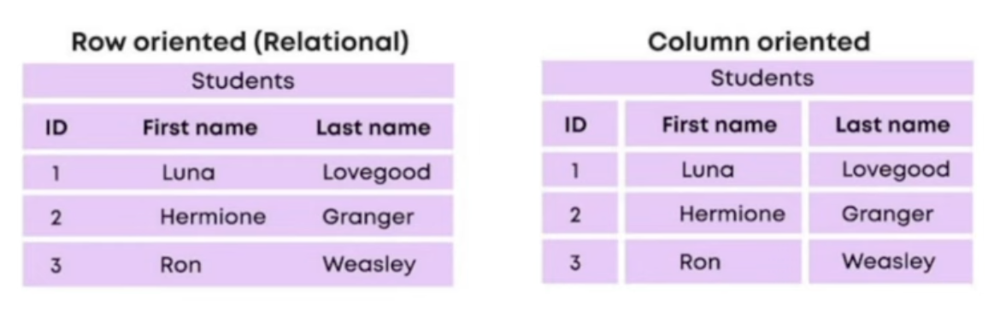

# Types of NoSQL Databases

**NoSQL**: It stands for `non-SQL` database or we can say that it is a non-relational database.

1. **Key-Value DB**: key-value database generally used for caching.

2. **Document DB**: Brings best of both RDBMS and NoSQL. It combines the relationship concept from RDBMS and dynamic schema and horizontal scaling from NoSQL databases.

3. **Columnar DB (Cassandra)**: The columns are stored together instead of rows. Because of that, the aggregation in such databases is rapid. It is widely used for Data analysis.

When we query on a subset of your data's columns. Because it just needs to read these specific columns, columnar DB conducts such queries quickly (while row-based DB would have to read the entire data).

4. **Graph DB**: Graph database represents and stores entities and relationships in the form of graph data structure. It is majorly used for social networks. When your data is in the form of a graph like social networks we use this.