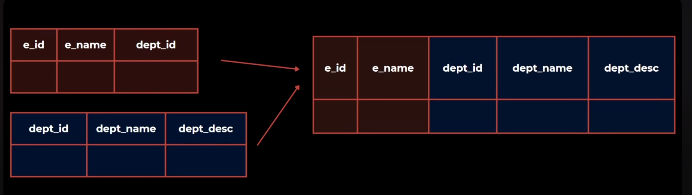

# What is denormalization in RDBMS?

Putting data in multiple tables to avoid redundancy.

## Denormalization
It combines the data and organizes it in a single table. Denormalization is the process of adding redundant data to the normalized relational database to optimize its performance.

## Benifits of Denormalization

1. Faster data read operations
2. Management convenience
3. High data availability
4. Reduces the number of network calls to fetch data from multiple places.

## Challenges of Denormalization

1. Redundant data -> Wastage of memory
2. It increases the complexity
3. Data inconsistency
4. It will cause slow write operations since we will need to write multiple places due to redundancy.

## Why Denormalization Is Used?

- Your application is read-heavy.
- Queries have too many joins and become slow.
- You want faster reporting / dashboards / analytics.
- You want to pre-calculate and store values.