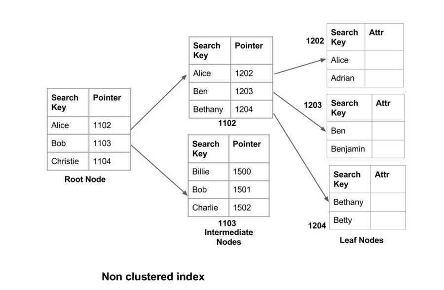

# How does indexing work in Databases
Indexing creates a lookup table with the column and the pointer to the memory location of the row, containing this column.

An **index** is a data structure (usually a **B-Tree**, B+Tree, or **hash table**) that improves the speed of data retrieval on a table **at the cost of extra storage and slightly slower writes**.

## How to optimize SQL Queries?
Using indexing we can optimize the SQL queries.

B-trees data structure is used to store the indexing as it is a multilevel format of tree-based indexing, which has balanced binary search trees.


## Think of it like:

- **Book without index** → To find a topic, you scan every page (Full Table Scan).
- **Book with index** → Go to index, jump to the exact page (Indexed Lookup).


## Why Is Indexing Used?

- Faster **SELECT queries**
- Faster **WHERE**, **ORDER BY**, **JOIN**, **GROUP BY**
- Preventing full table scans
- Improving performance on large datasets


## How Indexing Works Internally

### 1. Indexes store sorted key-value pairs

Example: You index column `name`.

Index structure stores:

```
Amit -> row pointer
Deepak -> row pointer
Rahul -> row pointer
```

Sorted structure allows **binary search** operations.

### 2. Index stores pointers to the actual table rows

It does NOT store the whole row.


## Types of Index Structures

### 1. B-Tree / B+Tree Index (most common)

Used in MySQL, PostgreSQL, Oracle.

* Good for range queries (`>`, `<`, BETWEEN)
* Good for sorting
* Balanced tree → O(log n) lookup time

### 2. Hash Index

Used in Redis, some Postgres cases.

* Very fast for equality (`=`) search
* Not good for range search

### 3. Bitmap Index

Used in data warehouses.

* Good for columns with low distinct values (gender, status)

## Types of Index

### 1. Primary Index

Automatically created on primary key.

### 2. Unique Index

Ensures no duplicate values.

### 3. Composite Index

Index on multiple columns:

```sql
INDEX (first_name, last_name)
```

Order matters!

### 4. Clustered Index

* Sorts the actual table data according to the index.
* Only ONE per table.
* Example: MySQL InnoDB uses primary key as clustered index.

### 5. Non-Clustered Index

* Stores separate index structure with pointers to data.
* Multiple allowed.


## When to Use an Index?

- Columns often used in **WHERE**
- Columns used in **JOIN**
- Columns used in **ORDER BY** or **GROUP BY**
- High-cardinality columns (many unique values)


## When NOT to Use Index?

- Low-cardinality columns (e.g., gender, boolean)
- Very small tables
- Columns that change very frequently
- Too many indexes → slow writes (INSERT/UPDATE/DELETE)


## Example in SQL

```sql
CREATE INDEX idx_users_email
ON users (email);
```

Now search becomes faster:

```sql
SELECT * FROM users WHERE email = 'test@gmail.com';
```

